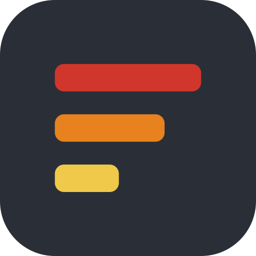
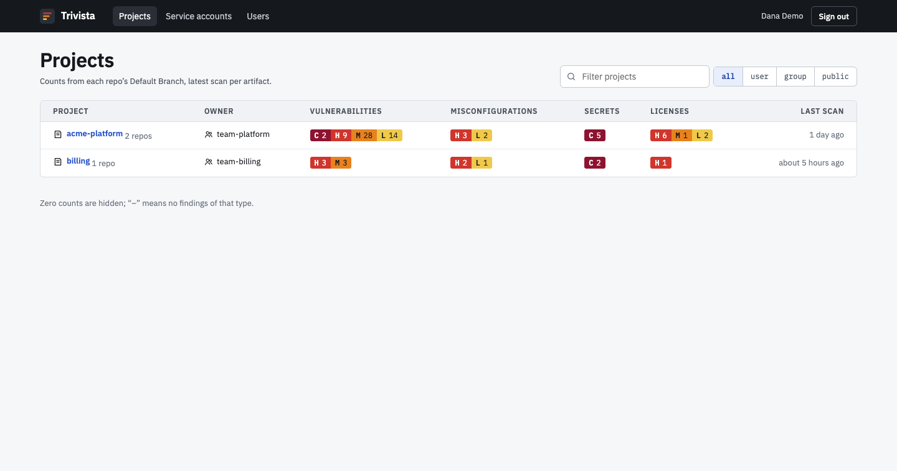
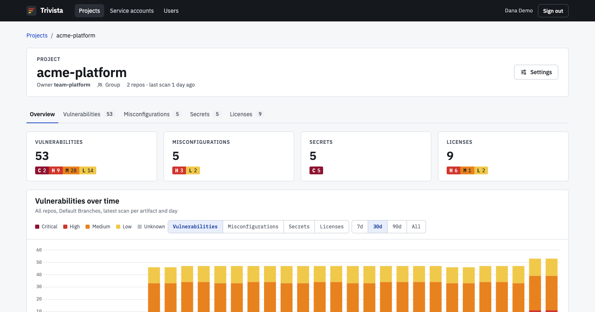
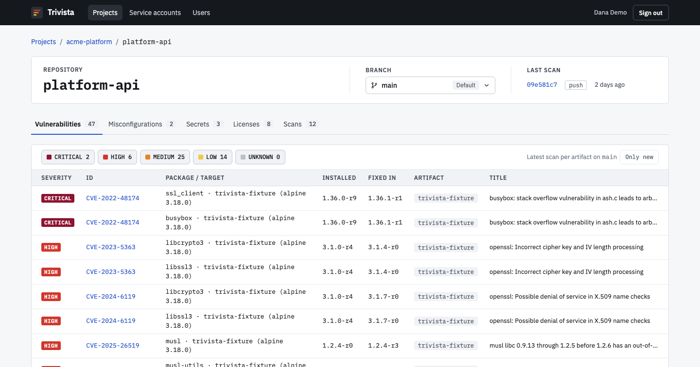
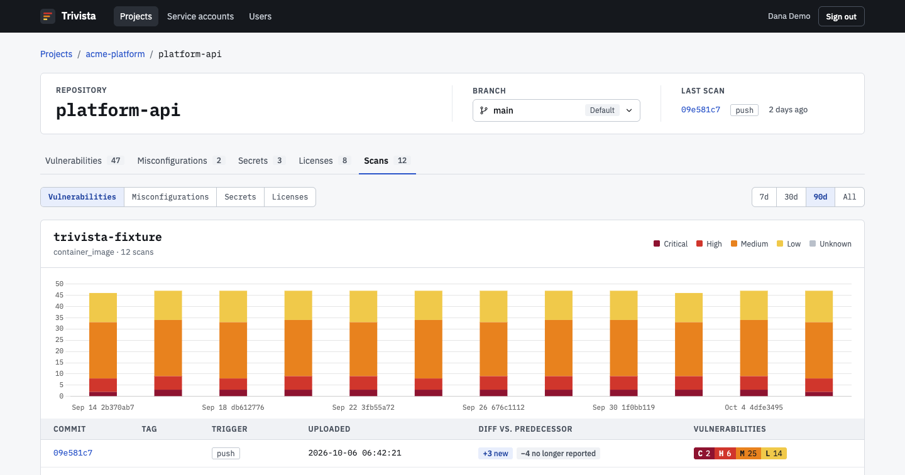
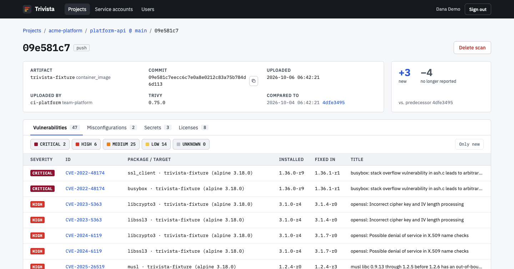

#  Trivista

Collects [Trivy](https://trivy.dev) reports from CI pipelines and shows the history of findings per project: vulnerabilities, misconfigurations, secrets and licenses, as trends per branch and as a diff to the previous scan. Read-only, login via OIDC, uploads via service account tokens.

Design decisions are documented in [`docs/adr/`](docs/adr), the vocabulary in [`CONTEXT.md`](CONTEXT.md).

## Screenshots

**Projects** with the current counts of each project's Default Branches:



**Project overview** summed over all repos, with the trend per day:



**Repo** with branch switch and the current findings of the selected branch:



**Scans** of a branch: trend per artifact and the diff of every scan to its predecessor:



**Scan** with metadata, diff summary and findings filtered by type and severity:



## Running

Trivista is a Rails 8 app shipped as one Docker image and needs a PostgreSQL database. Migrations run on container start.

```sh
docker build -t trivista .
docker run -p 3000:80 \
  -e RAILS_MASTER_KEY=... \
  -e DATABASE_URL=postgres://trivista:...@db:5432/trivista \
  -e OIDC_ISSUER=https://auth.example.com \
  -e OIDC_CLIENT_ID=... -e OIDC_CLIENT_SECRET=... \
  -e OIDC_REDIRECT_URI=https://trivista.example.com/auth/openid_connect/callback \
  -e OIDC_LOGIN_GROUP=trivista_users \
  trivista
```

The app expects TLS to be terminated in front of it (`assume_ssl`).

### Configuration

| Variable | Default | Purpose |
|---|---|---|
| `DATABASE_URL` | | PostgreSQL connection |
| `RAILS_MASTER_KEY` | | Decrypts `config/credentials.yml.enc` |
| `OIDC_ISSUER` | | Issuer URL, discovery is used |
| `OIDC_CLIENT_ID`, `OIDC_CLIENT_SECRET` | | OIDC client (authorization code flow with PKCE) |
| `OIDC_REDIRECT_URI` | | `https://<host>/auth/openid_connect/callback` |
| `OIDC_LOGIN_GROUP` | required | Only members may sign in; the app does not start without it |
| `OIDC_ADMIN_GROUP` | none | Members get the admin role |
| `OIDC_GROUPS_CLAIM` | `groups` | Claim carrying the group list |
| `OIDC_BREAK_GLASS_SUBJECTS` | none | Comma-separated `sub` values of the issuer that are always admin, bypass the login group and cannot be deactivated |
| `SESSION_MAX_AGE_HOURS` | `8` | Sessions end after this; group and role changes apply at the latest then |
| `UPLOAD_MAX_BYTES` | `52428800` | Maximum request body, enforced by Puma before the app (413) |
| `UPLOAD_RATE_LIMIT_PER_HOUR` | `60` | Uploads per token and hour (429) |
| `OCCURRENCE_QUOTA` | `5000000` | Stored occurrences per owner (507) |
| `TOKEN_MAX_LIFETIME_DAYS` | `365` | Upper bound for token expiry |
| `MAX_FINDINGS_PER_REPORT` | `50000` | Larger reports are rejected (422) before they are processed |
| `ARTIFACT_ACTIVITY_DAYS` | `30` | Artifacts without a scan in this window drop out of the project list counts |
| `RAILS_MAX_THREADS` | `3` | Puma threads |
| `RAILS_LOG_LEVEL` | `info` | |

### Identity provider

Request the scopes `openid profile email groups`. The groups claim must contain stable values: IDs or names that are never reused, otherwise a new group inherits the projects and service accounts of an old one. Users are identified by issuer and subject, not by email.

Trivista does not learn about offboarding in the identity provider. When someone leaves, an admin deactivates the user under *Users*; this revokes all tokens of the user's service accounts and all tokens the user created.

### Operations

- **Ingress**: allow request bodies up to `UPLOAD_MAX_BYTES` and the upload duration, enforce the limit there as well, and rate and connection limit uploads per IP. Puma buffers bodies before the token is checked.
- **Temporary files**: uploads are buffered unsanitized before the allowlist is applied. Mount an ephemeral volume (`emptyDir`, ideally `medium: Memory`) at `/tmp` and set an `ephemeral-storage` limit.
- **Memory**: one import runs per process at a time. A 50 MB report peaks at roughly 450 MB; plan about 1 GB per pod.
- **Health**: use `GET /up` for liveness and readiness probes. The image has no Docker `HEALTHCHECK`, Kubernetes ignores it anyway.
- **Database**: one database for app and cache. The database user needs `CREATEDB` only if the database does not exist yet.

## Uploading scans

1. Create a service account under *Service accounts*, owned by you or by one of your groups, and create a token. The token is shown once.
2. Run Trivy in CI and upload the JSON report:

```sh
trivy fs --format json --scanners vuln,misconfig,secret,license --list-all-pkgs=false --output trivy.json .

curl --fail-with-body -X POST "$TRIVISTA_URL/api/scans" \
  -H "Authorization: Bearer $TRIVISTA_TOKEN" \
  -F report=@trivy.json \
  -F project=my-project -F repo=my-repo \
  -F branch="$BRANCH" -F commit="$COMMIT" \
  -F trigger="$TRIGGER" -F tag="$TAG"
```

| Field | Required | Meaning |
|---|---|---|
| `report` | yes | Trivy JSON report (`SchemaVersion` 2) as file part |
| `project`, `repo`, `branch` | yes | Created on first upload within the namespace of the service account owner |
| `commit` | yes | Commit SHA |
| `trigger` | no | `push`, `tag`, `schedule`, `manual`, `pr` or `unknown` (default) |
| `tag` | no | Release tag |

The response is `201` with the scan URL in `Location`. Errors with a JSON body `{"error": "…"}`: `400` invalid input, `422` unsupported report (`trivy k8s`, `SchemaVersion` other than 2, too many findings, an identifying value such as `Target` or `PkgPath` longer than 1000 characters), `507` quota exceeded. Errors without a body: `401` token (with `WWW-Authenticate`), `413` too large (from Puma), `415` not multipart, `429` rate limit, `503` rate limit unavailable.

Recommendations:

- Trivy scans only vulnerabilities and secrets by default; pass `--scanners vuln,misconfig,secret,license` for all finding types.
- Keep the scan configuration of an artifact stable. Trivista cannot tell a fixed finding from one that is no longer scanned for, so the diff says *no longer reported*.
- Scan with `trivy fs .` from the checkout root. Paths containing build IDs create a new artifact per build.
- `--list-all-pkgs=false` makes reports smaller; the package inventory is not stored.
- Tag scans belong to the default branch: send the default branch as `branch` and the tag as `tag`. Pull request scans belong to their source branch.

### CI variables

| CI | Branch on tag pipelines | Branch otherwise | Commit | Tag | Event |
|---|---|---|---|---|---|
| GitLab | `$CI_DEFAULT_BRANCH` | `${CI_MERGE_REQUEST_SOURCE_BRANCH_NAME:-$CI_COMMIT_BRANCH}` | `$CI_COMMIT_SHA` | `$CI_COMMIT_TAG` | `$CI_PIPELINE_SOURCE` |
| GitHub Actions | `${{ github.event.repository.default_branch }}` | `${{ github.head_ref \|\| github.ref_name }}` | `${{ github.sha }}` | `${{ github.ref_name }}` | `${{ github.event_name }}` |
| Woodpecker | `$CI_REPO_DEFAULT_BRANCH` | `${CI_COMMIT_SOURCE_BRANCH:-$CI_COMMIT_BRANCH}` | `$CI_COMMIT_SHA` | `$CI_COMMIT_TAG` | `$CI_PIPELINE_EVENT` |
| Bamboo | | `${bamboo.planRepository.branchName}` | `${bamboo.planRepository.revision}` | | |

For example in GitLab:

```sh
if [ -n "$CI_COMMIT_TAG" ]; then
  BRANCH="$CI_DEFAULT_BRANCH" TAG="$CI_COMMIT_TAG" TRIGGER=tag
else
  BRANCH="${CI_MERGE_REQUEST_SOURCE_BRANCH_NAME:-$CI_COMMIT_BRANCH}" TAG="" TRIGGER=push
fi
```

Map the CI event to a `trigger` value (`push`, `tag`, `schedule`, `manual`, `pr`) or leave it out.

## Development

```sh
mise install
docker run -d --name trivista-postgres -e POSTGRES_PASSWORD=postgres -p 127.0.0.1:55432:5432 postgres:18
mise exec -- bin/ci
```

`mise.toml` provides Ruby, Trivy and the development environment variables; put personal overrides into `mise.local.toml`. `bin/ci` runs setup, RuboCop, the audits, Brakeman and the tests. Notes for AI coding agents are in `AGENTS.md`.

`bin/screenshots` regenerates the screenshots above from demo data built on the Trivy report fixtures; it needs Google Chrome.

`script/generate_trivy_fixtures` regenerates the Trivy report fixtures from throwaway sources with fake secrets; it needs Docker and Trivy. `trivy.yaml` excludes these fake secrets when Trivy scans this repository.

Woodpecker (`.woodpecker/`) runs `bin/ci` on every push and pull request in the `trivista-ci` image (`Dockerfile.ci`) and, on `main`, pushes `registry.metawave.ch/metawave/trivista` tagged `main-<created>-<sha>` and `latest`. It needs the secrets `registry_username` and `registry_password` and `woodpeckerci/plugin-docker-buildx` in `WOODPECKER_PLUGINS_PRIVILEGED`. The `ci-image` workflow rebuilds `trivista-ci` when `Gemfile`, `Gemfile.lock` or `Dockerfile.ci` change; run it manually once before the first pipeline. After the build, the `scan` workflow scans the checkout and the new image with Trivy and uploads both reports to Trivista itself (project and repo `trivista`); it needs the secret `TRIVISTA_TOKEN`.
